# DeFund DAO
*Version 0.0.5*

## Forewords
Before reading a single word of this White Paper there is something you need to understand:

__DeFund is not for people with a "get rich quick" mindset__.

I created this protocol to give its members job flexibility and financial freedom. If you want to make some easy money with no effort, this is not the place for you. If you're here to "flip coins" for a quick profit, this is not the place for you. If you believe that results can be achieved without sacrifice, guess what, THIS IS NOT THE PLACE FOR YOU.

DeFund has not been created just to give its members the opportunity to make money. Its vision is to deeply impact the way they work and interact, giving them the chance to shape the company the way they want.

With this premise, please, do not waste your time and money with this project if you don't want to contribute to it, or if your intentions are not aligned with the "warning traits" mentioned above.

# Table of Contents
1. [Introduction](#introduction)

2. [Culture](#example2)

    2.1 [Inviolable Principles](#inviolable_principles)

    2.2 [3-NOs Value](#3_nos_value)

3. [Structure](#structure)

    3.1 [Treasury](#treasury)

    3.2 [Leagues](#leagues)

    3.3 [Treasury League](#treasury_league)

    3.4 [Compliance League](#compliance_league)

    3.5 [Development League](#development_league)

    3.6 [Governance](#governance)

    3.6 [Pass](#pass)

4. [Proposals](#proposals)

    4.1 [Investment Proposals](#investment_proposals)

    4.2 [Governance Proposals](#governance_proposals)

    4.3 [Vision Proposals](#vision_proposals)

5. [Voting](#voting)

6. [Token](#token)

    6.1 [Staking](#staking)
 

## Introduction
DeFund is a democratic investment fund that invests in blockchain based companies and protocols by purchasing participations in their business and networks using the assets provided by its members.

Each member has the right to directly vote on which assets to buy, how to rebalance the current fund allocation, and how to improve the current investment policies, rules, and interactions.

Voting is made through the DEVC, an ERC-20 token which fuels all DeFund’s interactions.

The DEVC token can be obtained in four main ways: 
1. Transferred by DeFund to each investor, in proportion to the amount invested in the initial fundraising period;
2. Issued as remuneration for staking the DEVC token
3. Gained as a compensation for the activities performed for DeFund; or 
4. It can be simply buyed on the market after the fundraising period.

Only members with a DeFund Pass NFT can participate in the voting sessions. The vote weight of each member is calculated over the DEVC token current supply and it’s adjusted whenever new tokens are minted or burned.

DeFund tries to simplify the investment process by defining specific proposal types and templates, and by using tools like Tally (for proposals and voting) and Discord (communication) through which all members can interact with each other, monitor their investments, and oversee the treasury's current status.

Every single investment is proposed and voted by the DeFund members. No allocation or investment decision can be made without the 10% minimum consensus. All investment proposals are presented by the members directly on Tally, and can be voted by everyone owning the DeFund Pass NFT.

DeFund is a DAO, meaning that all rules governing the fund are written as a code, stored in Smart Contracts, and no individual can ever change them by any means. The only way to make changes and improvements is through creating, voting, and implementing new proposals.

##  Culture

###  Inviolable Principles
The Inviolable Principles are the moral and cultural foundation of DeFund. They're accepted by all DeFund’s members and they cannot be changed in any way. 

The Inviolable Principles are the following:

* DeFund cannot invest in projects related to humans and organs trafficking, arms dealing, drugs dealing, prostitution exploitation, child pornography and other activities contrary to public order, security and human dignity.
* DeFund can be dissolved at any time by a majority of 51% of the members only.
* DeFund must pay a minimum 5% annual fee to the Leagues.
* Whoever performs criminal acts against other DeFund’s members or through DeFund must be irrevocably excluded from DeFund itself.

###  3-NOs Value
The culture and all rules enforced by the DeFund protocol find their root on the following three values:
* __#1 NO entry barriers__
DeFund is and will always be public, democratic, and open to any kind of member. No restrictions of any kind will be ever applied except for the ones voted by its own members and compliant with the Inviolable Principles.

Following this value, everyone can become a member, but only who truly commit to improve DeFund can be eligible to be part of the Leagues and therefore make a huge impact on the protocol itself.

* __#2 NO titles__
Do you have a piece of paper that certifies that you're good at a certain task? Good, leave it at home. Here everyone starts at the same level. If you really have great skills at something you will lead the way in no time.

This value simply states that meritocracy is king on DeFund. Titles don't matter and involvement and committment are always rewarded.

* __#3 NO third chances__
Everyone can make a mistake and therefore everyone deserves a second chance, but not a third one. 

This value applies to everything, excluding the case that the Inviolable Principles are broken.

##  Structure
DeFund it’s divided into three main components that interact with each other:

* Treasury;
* Leagues; and
* Governance.

    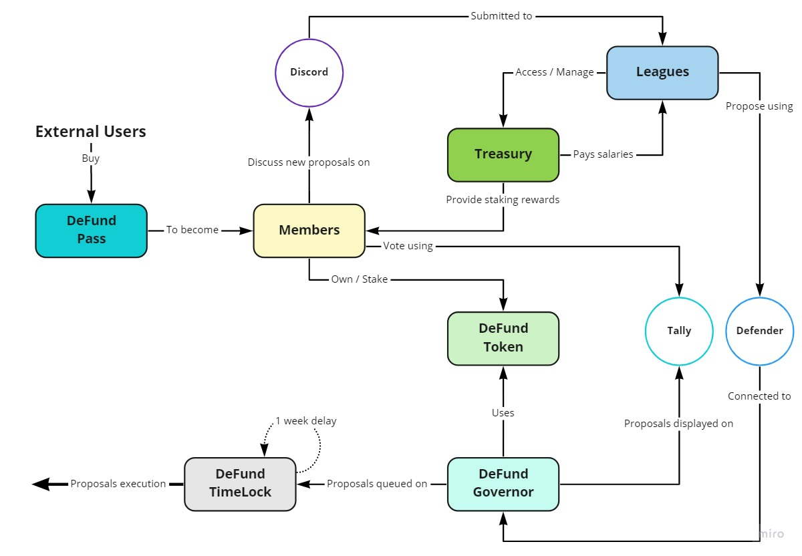

Each component is represented by one or more Smart Contracts which manage all roles and interactions between the different parts.

To better understand how each part works, and the mechanics governing the interactions between them, we’re going through each component of the following schema

###  Treasury
The Treasury is used for paying for expenses, fund new projects, and reward members, Leagues and Operators.

###  Leagues
Leagues are the DeFund implementation, monitoring, and regulatory body. Their primary objective is to enforce the fund's rules and implement the approved proposals by ensuring the highest standards in terms of transparency, quality, and verification.

Each League has a specific purpose that is directly related to a single company area.

    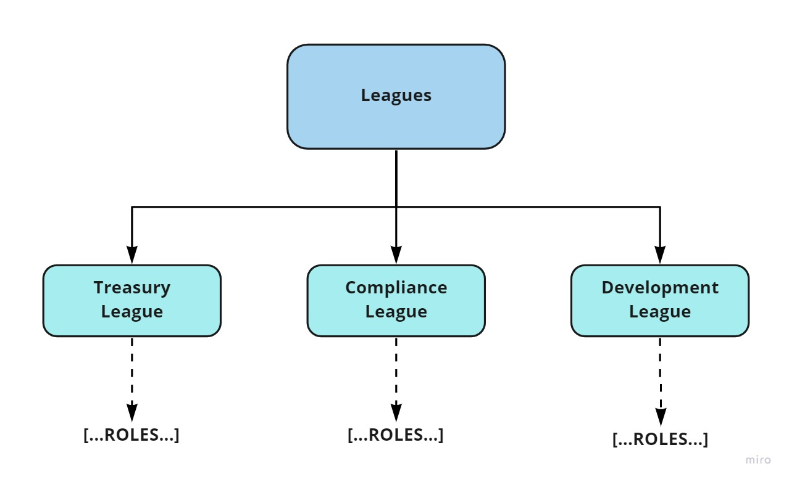

There are three different types of Leagues: 
* Treasury League;
* Compliance League; and
* Development League.

####  Treasury League
####  Compliance League
####  Development League

###  Governance

####  Pass
##### Description
The DeFund Pass is a NFT based badge that allows members to make proposals, vote, join specific and regulated channels on the Discord server, and in general to make an impact on the DeFund ecosystem. Each NFT contains its own information metadata that resides both on-chain and on IPFS.

Thanks to this hybrid approach all information concerning the Pass type and its details is stored on-chain in the form of a *base64* encoded *json* file. On the other hand, the NFT images are stored on IPFS due to their high storage size.

##### Specs
1. Each Role, also the standard _Member_ role, needs its own Pass to access and interact with the DeFund ecosystem.
2. All Roles in the same League have the same Pass, that only differs for the attributes it contains in its metadata.
3. Each pass is minted or burned through the voting mechanism.
4. Pass ids start from 0. The id is incremented every time a new Pass is minted
5. By design, Pass owners are not allowd to mint, transfer, or burn any Pass.
6. Eeach Pass, as well as its owner, is unique by definition. No Pass can be owned by more than one DeFund member.
7. Passes cannot be transferred, not even through a dedicated proposal. In case of a new member is selected and another member with same role is removed, the Pass from the removed member is burned, and the new Pass for the new member is minted.
8. League members must be members, first. Then they can request to the appropriate League to become a League members through the minting of a new League Pass.
8. Each member can own at most one Pass. No one can have more than one role throughout the entire DeFund ecosystem. This rules applies to everyone. The only "exception" are League members, who must wn 2 passes: one Standard pass, and one League pass.
9. Roles can be added and deleted through the voting mechanism. Roles addition and deletion can be executed directly by the Smart Contract, after the appropriate proposal has been passed.

###  Proposals
Proposals are the enhancements and modifications requested by DeFund's members. 
There are three different types of proposals, each one created with the aim of providing the most appriopriate and clear information about the specific motion:

    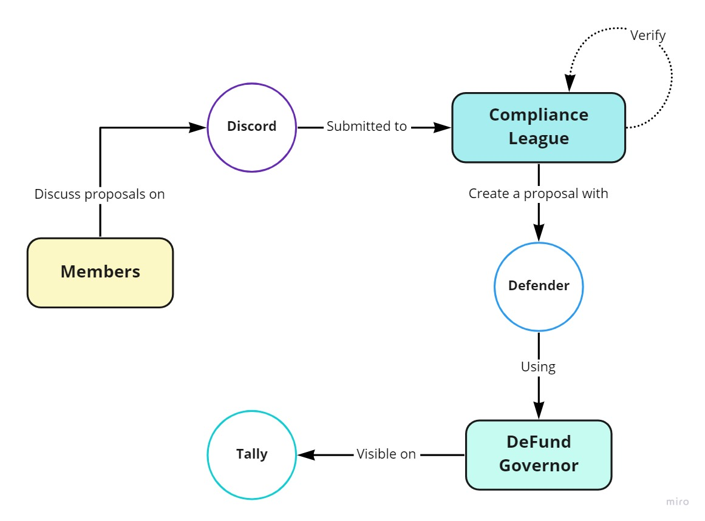

* Investment Proposals;
* Governance Proposals; and
* Vision Proposals

####  Investment Proposals
####  Governance Proposals
####  Vision Proposals

Each proposal type represents a current state variation request on a specific area.
###  Voting

    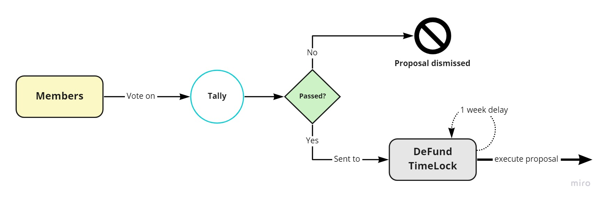

##  Token
The DEVC token is a standard ERC-20 token capped to 280,389,000 units.

###  Staking
 
The initial APY will be 1,000%. This huge number will be halved at regualar intervals, that is, every 120 days starting from the approval of the Vision Proposal.
Rewards are calculated on a monthly basis and members can earn the full APY only if they have voted for every single proposal in the past month. In fact, the monthly reward is multiplied by the % of voted proposals over the total proposals of the 0preceding month.

Calculate staking reward:

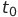 = Vision Proposal passing date

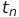 = Current date

 = Staked amount at month *n*

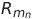 = Staking reward at month *n*

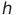 = Current halving value

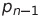 = Total proposals at month *n-1*

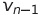 = Total voted proposals at month *n-1*

    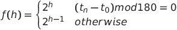
     
    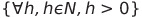
     
     

Therefore, it is possible to calculate the staking reward at month *n* using the following formula:

    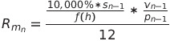
     
     

The following chart shows how APY decreases over the months:

     
    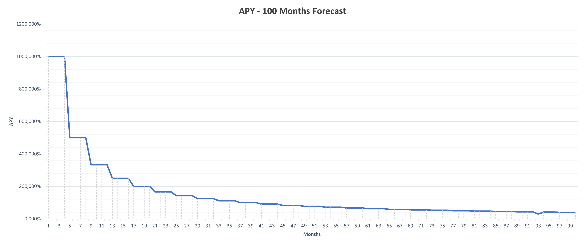

And finally here's the total monthly staking rewards provided by DeFund. The model takes into account a member acquisition rate starting from 105% for the first 2 months, and then gradually decreasing until reaching 0.001% over a period of 100 months (~8 years);

     
    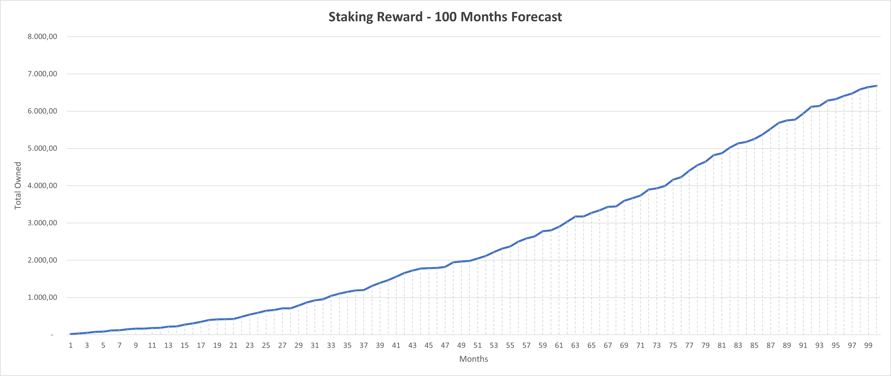

